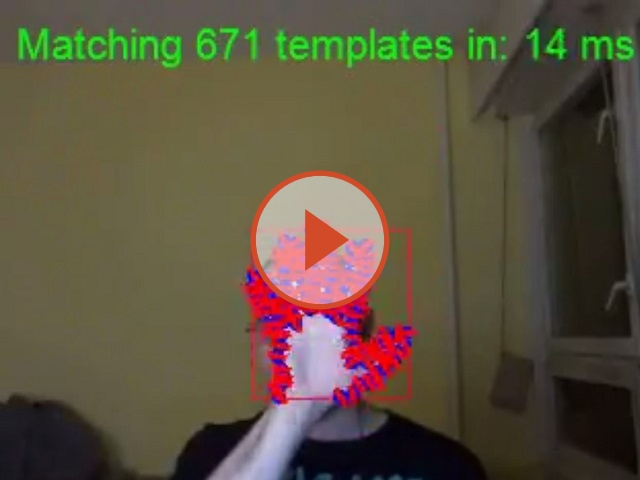
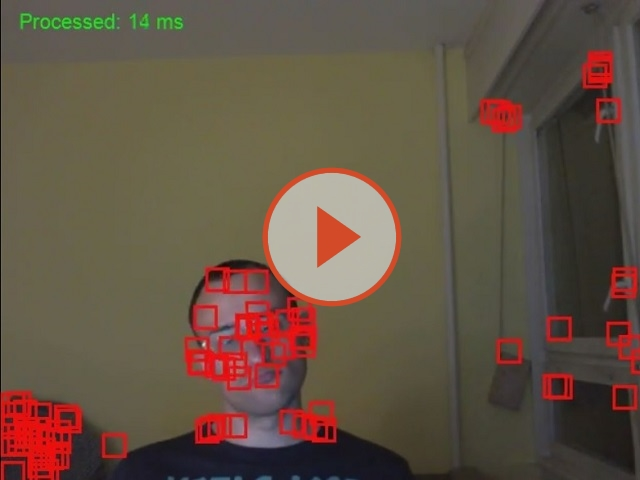
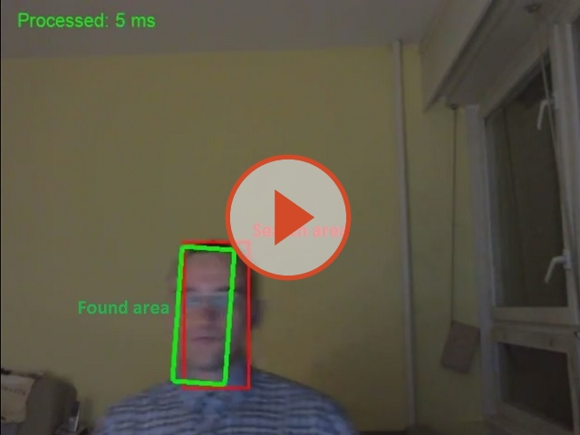
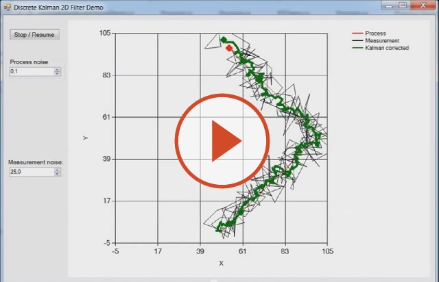
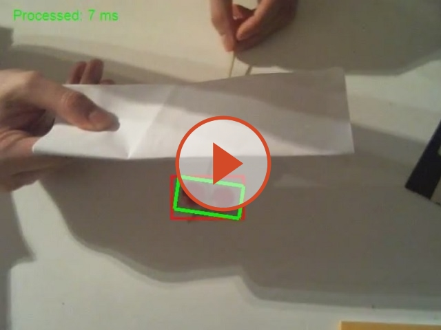
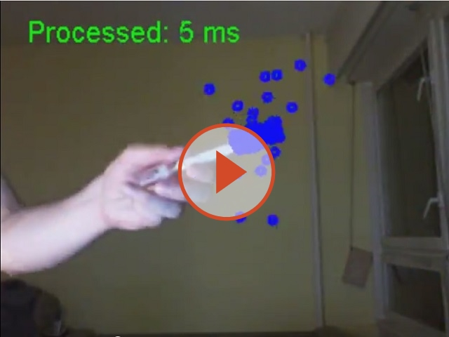
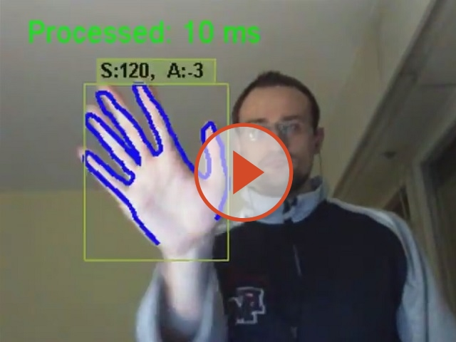

<table>
    <tr>
        <td>
            
        </td>

        <td>
            <ul>
                <li>Version: 2.5</li>
                <li>NuGet packages: <a href="https://www.nuget.org/profiles/dajuric"><strong>ready</strong></a></li>
                <li>
                    Help: <a href="https://github.com/dajuric/accord-net-extensions/raw/master/Deployment/Documentation/Help/Accord.NET%20Extensions%20Documentation.chm"> Offline </a> - <i>unblock after download!</i>
                </li>
            </ul>
        </td>
    </tr>
</table>

    <b>Accord.NET Extensions</b> is an extension framework for <a href="http://accord-framework.net/"> Accord.NET </a> and <a href="http://www.aforgenet.com/framework/license.html">AForge.NET</a>.
    The framework sets focus on .NET native array as primary imaging object, offers algorithms build as extensions, and provides unified platform-abstract imaging IO API. The libraries can be grouped as following:

<h3>Image processing</h3>

<ul>
    <li>
        

            <b>
                <a href="https://www.nuget.org/packages/Accord.Extensions.Imaging.Algorithms/">Accord.Extensions.Imaging.Algorithms package</a>
            </b>
             
            Implements image processing algorithms as .NET array extensions including the Accord.NET algorithms.
        

        <table border="0" cellpadding="1" cellspacing="1">
            <tbody>
                <tr>
                    <td align="center" width="100%">
                        
                    </td>
                </tr>
            </tbody>
        </table>
    </li>

    <li>
        

            <b>
                <a href="https://www.nuget.org/packages/Accord.Extensions.Imaging.Algorithms.LINE2D/">Accord.Extensions.Imaging.Algorithms.LINE2D package</a>
            </b>
             
            Implements template matching algorithm (~20x faster than conventional sliding window approach).
        

        

            <b>Tutorials:</b> <a href="http://www.codeproject.com/Articles/826377/Rapid-Object-Detection-in-Csharp" target="_blank">Fast template matching</a>
        

        <table border="0" cellpadding="1" cellspacing="1">
            <tbody>
                <tr>
                    <td align="center" width="100%">
                        
                    </td>
                </tr>
            </tbody>
        </table>
    </li>

    <li>
        

            <b>
                <a href="https://www.nuget.org/packages/Accord.Extensions.Vision/">Accord.Extensions.Vision package</a>
            </b>
             
            Pyramidal KLT tracker, Camshift, Meanshift
        

        

            <b>Tutorials:</b>
            <a href="http://www.codeproject.com/Articles/840823/Object-Feature-Tracking-in-Csharp" target="_blank">Object Feature Tracking</a>
        

        <table border="0" cellpadding="1" cellspacing="1">
            <tbody>
                <tr>
                    <td align="center" width="50%">
                        
                    </td>
                    <td align="center" width="50%">
                        
                    </td>
                </tr>
            </tbody>
        </table>
    </li>
</ul>

<h3>Math libraries</h3>

<ul>
    <li>
        

            <b>
                <a href="https://www.nuget.org/packages/Accord.Extensions.Math/">Accord.Extensions.Math package</a>
            </b>
             
            Fluent matrix extensions. Geometry and graph structures and extensions.
        

    </li>

    <li>
        

            <b>
                <a href="https://www.nuget.org/packages/Accord.Extensions.Statistics/">Accord.Extensions.Statistics package</a>
            </b>
             
            Object tracking algorithms: Kalman filter, particle filter, Joint Probability Data Association Filter (JPDAF).
             
        

        

            <b>Tutorials:</b> <a href="http://www.codeproject.com/Articles/865935/Object-Tracking-Kalman-Filter-with-Ease" target="_blank">Kalman filter</a>,
            <a href="http://www.codeproject.com/Articles/865934/Object-Tracking-Particle-filter-with-ease" target="_blank">Particle filter</a>
        

        <table border="0" cellpadding="1" cellspacing="1">
            <tbody>
                <tr>
                    <td align="center" width="50%">
                        
                    </td>
                    <td align="center" width="50%">
                        
                    </td>
                </tr>

                <tr>
                    <td align="center" width="50%">
                        
                    </td>
                    <td align="center" width="50%">
                        
                    </td>
                </tr>
            </tbody>
        </table>

    </li>
</ul>

<h3>Support libraries</h3>

<ul>
    <li>
        

            <b>
                <a href="https://www.nuget.org/packages/Accord.Extensions.Imaging.AForgeInterop">Accord.Extensions.Imaging.AForgeInterop package</a>
            </b>
             
            Interoperability extensions between .NET array and AForge's UnmanagedImage.
        

    </li>

    <li>
        

            <b>
                <a href="https://www.nuget.org/packages/Accord.Extensions.Core">Accord.Extensions.Core package</a>
            </b>
             
            Element caching, parallel extensions, shared structures.
        

    </li>
</ul>

<h2>Getting started</h2>

    Browse through some included samples, install NuGet packages and enjoy!
	Also take a look at: <a href="https://github.com/dajuric/dot-imaging">DotImaging</a> - the portable imaging library which is the foundation library for Accord.NET Extensions

<h2>How to Engage, Contribute and Provide Feedback</h2>

   The best ways to contribute and provide feedback is to try things out, file bugs and propose enhancements. Your opinion is important and will define the future roadmap. If you have any questions, comments or you would like to propose an enhancement please leave the message on Github, or write to: darko.juric2 [at] gmail.com.

<h2>Final word</h2>

     If you like the project please <b>star it</b> in order to help to spread the word.
     That way you will make the framework more significant and in the same time you will motivate me to improve it, so the benefit is mutual.

